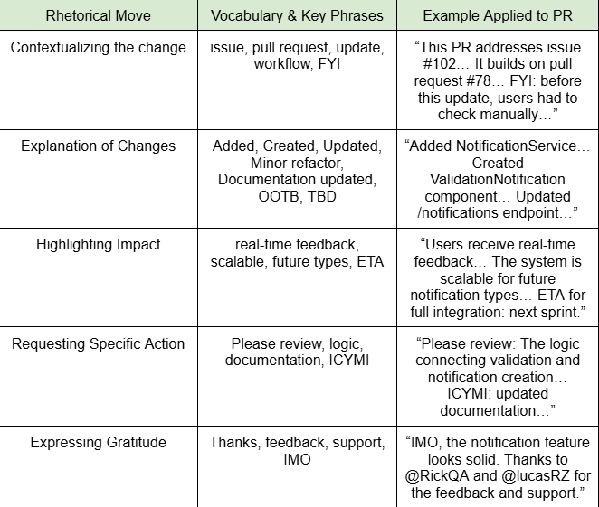

# English II — Pull Request Exercise

This repository is for **English II class practice**.  
It contains exercises related to **writing Pull Requests**, including:

- Organizers with rhetorical moves
- Vocabulary & key phrases for PRs
- Sample Pull Request submissions

This repo is **for educational purposes only**.

## Organizer Graphic

The following organizer table summarizes the **rhetorical moves** and **key phrases** used in the Pull Request exercise:

This table helps guide the writing of the PR and shows how vocabulary and phrases are applied in context.

## Additional Resources
- [Technical Writing Tips](https://maddevs.io/blog/how-to-make-a-proper-description-for-a-pull-request/)